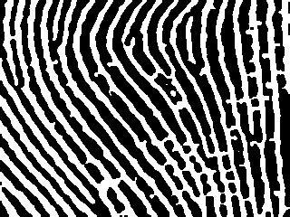

#  _Digital Image Process_ Project 1

## Description
Use the image processing method to extract the ridges in the fingerprint image and output a mask. However, there is a high-resolution fingerprint image acquisition device that randomly applies a noise during the image acquisition due to the device itself. You are required to first eliminate this noise through the knowledge you have learned in class, and then extract the ridge.

## Goal

1. Eliminate the random noise (Salt, Pepper, Gaussian)
2. Fill/Remove the pore in the image
3. Enhance the ridge of fingerprint

## Solution
- Use median blur for salt and pepper noise
- Use Gaussian blur for Gaussian noise
- Remove the pore by finding and removing outlier with threshold of size 5*5
- Some morphological transformations

## Results
- Original image

    
- Result

    
- Original image

    
- Result

    
- Original image

    
- Result

    
## Requirements
Requirements can be found in the _requirements.txt_
- opencv_python==3.4.3.18
- numpy==1.15.4

